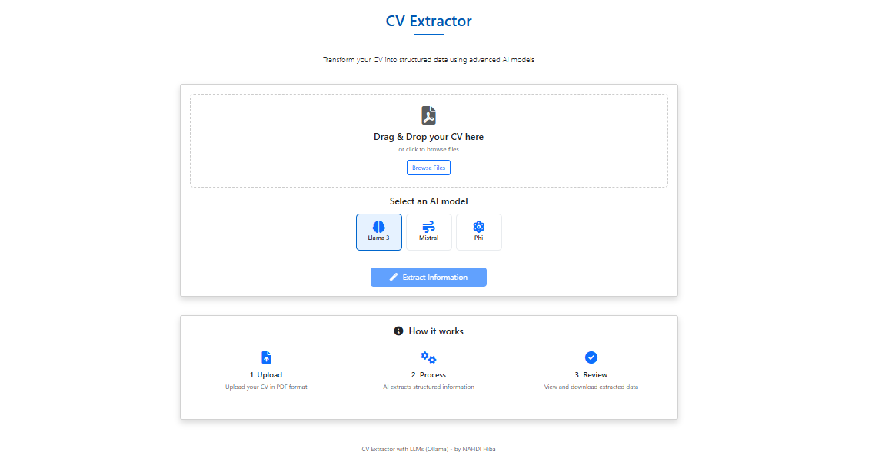

# CV Extractor Project

Extract structured information from CVs and resumes with AI precision.




## 🔍 Overview

This project extracts structured information from CVs/resumes using PDF processing techniques and LLM-powered text analysis. It features a comprehensive evaluation system to compare the performance of different language models.

## ✨ Features

- 📄 **PDF Text Extraction**: Extract text from digital PDFs with PyMuPDF
- 🔍 **Advanced OCR**: Process scanned documents with Google's Gemini model
- 🤖 **Multi-Model Support**: Compare extractions from multiple LLMs
- 🌐 **Web Interface**: Upload and process CVs through a browser
- 🔌 **API Access**: Programmatic access for integration
- 📊 **Detailed Analytics**: Compare model performance with metrics
- 💾 **Structured Output**: Results formatted in consistent JSON
- 📚 **Batch Processing**: Process multiple CVs in one go

## 🚀 Getting Started

### Docker Setup (Recommended)

```bash
# Build and start with Docker Compose
docker-compose up -d

# Or build the Docker image manually
docker build -t cv-extractor .

# Run the container (Windows PowerShell)
docker run -p 5000:5000 -v ${PWD}/data:/app/data -e "GOOGLE_API_KEY=your_key_here" -e "OPENROUTER_API_KEY=your_key_here" cv-extractor

# Run the container (Linux/Mac)
docker run -p 5000:5000 -v $(pwd)/data:/app/data -e "GOOGLE_API_KEY=your_key_here" -e "OPENROUTER_API_KEY=your_key_here" cv-extractor
```

### Local Setup

1. **Clone the repository**

```bash
git clone https://github.com/Hiba2222/cv_extractor_project.git
cd Resume_extractor_project
```

2. **Set up a virtual environment**

```bash
python -m venv venv
# On Windows
venv\Scripts\activate
# On macOS/Linux
source venv/bin/activate
```

3. **Install dependencies**

```bash
pip install -r requirements.txt
```

4. **Configure environment variables**

```bash
cp .env.example .env
# Edit .env with your API keys and paths
```

> **Model Access Options:** 
> - Configure Ollama for local model inference (recommended for privacy)
> - Or set up an OpenRouter API key for cloud-based model access (alternative if Ollama setup is problematic)
> - System will automatically use OpenRouter if Ollama is unavailable

5. **Start the application**

```bash
# New recommended way
python bin/run_web.py

# Or use the legacy entry point (redirects to bin/)
python run_web.py
```

## 🖥️ System Requirements

- **Operating System**: Windows 10+, macOS 10.15+, or Linux (Ubuntu 18.04+)
- **Python**: 3.9 or higher
- **RAM**: 12GB minimum, 16GB recommended
- **Storage**: 500MB for application, plus space for CV storage
- **Dependencies**:
  - Poppler (for PDF processing)
  - CUDA-compatible GPU (optional, for faster processing)

## 🧠 Models Supported

| Model        | Provider      | Type          | Best For              | Integration |
|--------------|---------------|---------------|------------------------|------------|
| Llama3       | Ollama/Meta   | Local/API     | Overall extraction     | Direct/OpenRouter |
| Mistral      | Mistral AI    | API           | Education & experience | OpenRouter |
| Phi-3        | Microsoft     | API           | Basic fields           | OpenRouter |
| GPT-4        | OpenAI        | API           | Complex documents      | Direct     |
| Gemini 1.5 Flash | Google    | API           | OCR & image extraction | Direct     |

> **Note:** For users experiencing issues with Ollama, the system provides automatic fallback to OpenRouter API for accessing models like Llama3, ensuring uninterrupted service.

## ⚙️ How It Works

1. **Document Processing**:
   - PDF text extraction using PyMuPDF
   - Image-based PDFs processed with OCR via Gemini 1.5 Flash
   - Text cleaning and normalization

2. **Information Extraction**:
   - Structured prompting to LLMs
   - Field-specific extraction patterns
   - Fallback mechanisms between models
   - Automatic switching between Ollama (local) and OpenRouter (cloud) as needed

3. **Result Processing**:
   - JSON formatting and validation
   - Confidence scoring for extracted fields
   - Structure normalization

4. **Evaluation Pipeline**:
   - Ground truth comparison
   - Field-specific metrics
   - Cross-model performance evaluation

## 📊 Model Performance

Our evaluation system compares model performance across different CV fields:

| Model   | Name  | Email | Phone | Skills | Education | Experience | Overall |
|---------|-------|-------|-------|--------|-----------|------------|---------|
| Llama3  | 1.00  | 1.00  | 0.98  | 0.74   | 0.92      | 0.47       | 0.81    |
| Mistral | 0.75  | 0.74  | 0.75  | 0.42   | 0.74      | 0.36       | 0.59    |
| Phi     | 0.38  | 0.74  | 0.75  | 0.38   | 0.74      | 0.38       | 0.52    |

*Note: Run `python bin/run_evaluation.py` to generate performance visualizations and detailed reports.*

## 💡 Usage Instructions

### Using Launcher Scripts (Recommended)

The project includes launcher scripts for easy startup:

**Windows Users:**
```bash
# Double-click run.bat or run from PowerShell/Command Prompt
.\run.bat
```

**Linux/Mac Users:**
```bash
# Make the script executable first
chmod +x run.sh
# Run the script
./run.sh
```

Both scripts provide an interactive menu to:
1. Start the application with Docker (recommended)
2. Start with Python directly
3. Stop running Docker containers
4. Exit

### Web Interface

1. Access the web interface at http://localhost:5000
2. Upload a CV/resume in PDF format
3. Select an AI model for processing
4. View structured results and download as JSON

### API Usage

```bash
# Basic usage
curl -X POST -F "pdf_file=@/path/to/your/cv.pdf" -F "models=llama3" http://localhost:5000/api/extract

# Multiple models
curl -X POST -F "pdf_file=@/path/to/your/cv.pdf" -F "models=llama3,mistral,phi" http://localhost:5000/api/extract

# With specific parameters
curl -X POST -F "pdf_file=@/path/to/your/cv.pdf" -F "models=llama3" -F "confidence_threshold=0.7" http://localhost:5000/api/extract
```

### Command-line Processing

Run the complete pipeline:

```bash
python bin/pipeline.py --input data/input --output data/output --results data/results --models llama3,mistral,phi
```

Or use individual modules:

```bash
# Extract text from PDFs
python -m cv_extractor.pdf.extractor

# Process text with LLMs
python -m cv_extractor.llm.processor --input input.txt --output output.json
```

## 🔍 Evaluation System

### Running an Evaluation

To evaluate model performance:

```bash
python bin/run_evaluation.py
```

This script will:
1. Read and normalize all ground truth files
2. Process model results
3. Generate test results for missing model-CV combinations
4. Calculate performance metrics
5. Create visualizations and reports

### Adding Custom Evaluation Data

1. **Create ground truth files**:
   - Add JSON files to `data/ground_truth/` named like `gt1.json`, `gt2.json`, etc.
   - Follow the existing format with fields like "Name", "Email", "Phone", "Skills", etc.

2. **Add model results**:
   - Process CVs with your models
   - Save results to `data/evaluation/model_results/{model_name}/` directory
   - Follow the naming convention: `cv{number}_result.json`

## 📁 Directory Structure

```
Resume_extractor_project/
├── cv_extractor/             # Main Python package
│   ├── __init__.py           # Package initialization
│   ├── config.py             # Centralized configuration
│   ├── pdf/                  # PDF processing module
│   │   ├── __init__.py
│   │   └── extractor.py      # PDF text extraction
│   ├── llm/                  # LLM processing module
│   │   ├── __init__.py
│   │   └── processor.py      # LLM integration
│   ├── web/                  # Web interface module
│   │   ├── __init__.py
│   │   ├── app.py            # Flask web application
│   │   ├── static/           # Static CSS, JS, and images
│   │   │   ├── style.css
│   │   │   ├── scripts.js
│   │   │   └── interface1.png
│   │   └── templates/        # Flask HTML templates
│   │       ├── base.html
│   │       ├── index.html
│   │       ├── result.html
│   │       ├── error.html
│   │       └── macros.html
│   └── evaluation/           # Evaluation module
│       ├── __init__.py
│       ├── core.py           # Evaluation framework
│       └── runner.py         # Evaluation pipeline
├── bin/                      # Entry point scripts
│   ├── run_web.py            # Web application launcher
│   ├── pipeline.py           # Processing pipeline
│   └── run_evaluation.py    # Evaluation runner
├── data/                     # Data directories
│   ├── input/                # CV PDFs to process
│   ├── output/               # Extracted text files
│   ├── results/              # Structured JSON results
│   ├── uploads/              # Web upload temporary storage
│   ├── ground_truth/         # Manual annotations for evaluation
│   │   ├── gt1.json
│   │   ├── gt2.json
│   │   ├── gt3.json
│   │   ├── gt5.json
│   │   └── gt6.json
│   └── evaluation/           # Processed evaluation data
│       ├── combined_ground_truth.json
│       └── model_results/    # Results by model
│           ├── llama3/
│           ├── mistral/
│           └── phi/
├── pipeline.py               # Legacy entry point (redirects to bin/)
├── run_web.py                # Legacy entry point (redirects to bin/)
├── run.sh                    # Launcher script for Linux/Mac
├── run.bat                   # Launcher script for Windows
├── Dockerfile                # Container definition
├── docker-compose.yml        # Docker orchestration
├── requirements.txt          # Python dependencies
├── .env.example              # Example environment variables
├── .env                      # Environment variables (not in git)
├── .gitignore                # Git ignore rules
├── REORGANIZATION_SUMMARY.md # Project reorganization notes
└── README.md                 # Project documentation
```


## 🐳 Dockerization

The project includes Docker support for easy deployment and consistent runtime environment.

### Building and Running with Docker Compose

The simplest way to run the application:

```bash
# Build and start the container
docker-compose up -d

# View logs
docker-compose logs -f

# Stop the container
docker-compose down
```

### Building and Running with Docker

If you prefer using Docker directly:

```bash
# Build the Docker image
docker build -t cv-extractor .

# Run the container (Windows PowerShell)
docker run -p 5000:5000 -v ${PWD}/data:/app/data -e "GOOGLE_API_KEY=your_key_here" -e "OPENROUTER_API_KEY=your_key_here" cv-extractor

# Run the container (Linux/Mac)
docker run -p 5000:5000 -v $(pwd)/data:/app/data -e "GOOGLE_API_KEY=your_key_here" -e "OPENROUTER_API_KEY=your_key_here" cv-extractor
```

### Container Details

- **Base image**: Python 3.9 (slim)
- **Exposed port**: 5000
- **Mounted volumes**:
  - `./data:/app/data`: Persists all data files (input, output, results, uploads)
- **Dependencies**: Includes Poppler for PDF processing and other required system libraries

### Environment Variables

Environment variables can be set in the `.env` file or passed directly to the container:

**Required:**
- `GOOGLE_API_KEY`: Google Gemini API key for OCR processing
- `OPENROUTER_API_KEY`: OpenRouter API key for LLM access

**Optional:**
- `DEFAULT_MODELS`: Comma-separated list of models (default: `llama3,mistral,phi`)
- `FLASK_PORT`: Web server port (default: `5000`)
- `FLASK_ENV`: Environment mode (default: `development`)
- `OCR_ENABLED`: Enable OCR for scanned PDFs (default: `true`)
- `LOG_LEVEL`: Logging level (default: `INFO`)

**Example:**
```bash
docker run -p 5000:5000 \
  -v $(pwd)/data:/app/data \
  -e "GOOGLE_API_KEY=your_google_key" \
  -e "OPENROUTER_API_KEY=your_openrouter_key" \
  -e "DEFAULT_MODELS=llama3,mistral" \
  cv-extractor
```

## 📄 License

[MIT License](LICENSE)

## 🙏 Acknowledgements

- Google's Gemini 1.5 Flash API for OCR capabilities
- PyMuPDF for PDF processing
- Ollama for local LLM inference 